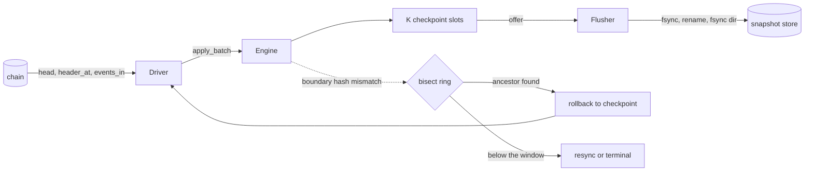

# chainfold

A sans-io fold engine for ordered chain events, with fork recovery and durable snapshots.

<!-- ANCHOR: intro -->
chainfold folds ordered chain events into consumer state: engine-enforced total
order over (block, log_index), fork detection by ancestry commitment, bounded
rollback to retained checkpoints, and a durable snapshot envelope.

### how it works

A relayer or wallet polls logs from one chain and folds them into local state. The chain
reorgs, the node lags, the process restarts. Every consumer rewrites that loop, and the
loop is where the bugs live: skip-and-diverge on a failed event, a cursor that is not
durable, a reorg noticed only when a proof stops verifying.

- **apply**: a poll fills one `Batch`; the `Engine` enforces the total order, drops
  everything at or below the cursor as already applied, and counts the events the fold
  declares are not its own.
- **detect**: each batch carries the current header of the cursor block. A block hash
  commits to its whole ancestry, so a reorg touching anything at or below the cursor
  changes that one hash. One header per poll, one 40-byte compare.
- **recover**: on a mismatch, the driver bisects the ring of observed blocks with
  `header_at` for the deepest still-canonical block, rolls back to the newest checkpoint
  at or below it, and refolds forward. `O(log W)` probes, then deterministic replay.
- **persist**: the driver offers the oldest retained checkpoint to a sink; a flusher
  thread fsyncs it. The durable cursor trails the applied cursor and names what a
  restart recovers, so the apply path never fsyncs and replay closes the gap.



Fold state is fully generic; the crate pins no provider, no runtime, and no storage
engine in its core. This approach makes tradeoffs specific to its callers and is not
intended for production use.
<!-- ANCHOR_END: intro -->

## design

<!-- ANCHOR: design -->
Three layers, each usable without the one above it: the `Engine` (`no_std` + `alloc`,
sans-io, single writer), the `Driver` (sans-runtime, owning cadence, backoff, scanning,
and recovery), and the adapters (`std`: tokio harness, snapshot store, flusher).

- `Position` is `(block, log_index)`. `log_index` is block-unique on EVM, so a tx index
  would be redundant and invite inconsistent adapters.
- dedup is positional only. The cursor is the sole mechanism; there is no seen-set to
  grow without bound.
- `FoldError` is classified at the fold, not guessed by the engine: `Skip` (not mine,
  counted and stepped over), `Halt` (clean below this position, rollback or resync),
  `Poison` (partially mutated, untrusted until a restore).
- `Source` is three reads: `head`, `header_at`, `events_in`. The driver owns the window
  walk, the scan mark, the boundary refetch, and the grouping into spans, so a source
  cannot get the batch shape wrong and every source gets fork detection. `Ok(None)` from
  a probe means suspected fork.
- rollback is bounded to K retained checkpoints. Over-rollback past still-canonical but
  unobserved blocks is intended; the discarded events replay deterministically.
- the recovery ladder is rollback, then resync from genesis, then a typed terminal state.
  `DivergenceCause` names which rung ran out: fork deeper than the window, no checkpoint
  below the ancestor, source horizon short of the start block.
- `EngineStatus::Unrecoverable` is only left by a `reset`. Automated progress stops
  rather than folding on untrusted state.
- the snapshot envelope is engine-owned: magic, format version, fold identity tag,
  cursor, observed ring, state bytes, CRC32C trailer. The ring travels inside it, so a
  restarted engine detects a reorg that happened while it was down.
- lengths decoded from stored bytes are bounded before any allocation and every offset is
  checked, so a corrupt length prefix is a typed error rather than an OOM primitive.
- the durable cursor rides the manifest as a watermark. Commit writes a temp file, fsyncs
  it, renames, then fsyncs the directory; the manifest is dual-slot, and a commit
  overwrites the older slot so a torn write only damages the copy already superseded.
- the watermark names the snapshot the manifest points at, so a resync that persists
  state from genesis lowers it. Reporting the old height would promise a restart point
  the store no longer holds, and holding the pre-resync snapshot would recover state
  folded on a chain that no longer exists.
- the observed ring is structure-of-arrays with power-of-two capacity, so bisection binary
  searches the number lane alone and touches one hash at the end. W = 1024 is 40 KiB.
- `Batch` is flat: one contiguous event array plus a span array indexing into it. Two
  allocations per poll, both pooled and reused by the driver.
- the apply path allocates zero. That is a CI assertion under a counting allocator, not a
  convention.
- one engine per chain. Coordinated cross-chain rollback is an explicit non-goal;
  consumers join across chains themselves.
<!-- ANCHOR_END: design -->

## usage

<!-- ANCHOR: usage -->

### fold and engine (`default-features = false`)

```rust,ignore
use chainfold::{Engine, EngineConfig, Fold, FoldError, Position};

#[derive(Clone, Default)]
struct Balances { total: u128 }

impl Fold for Balances {
    type Event = u128;
    type Error = &'static str;

    fn apply(&mut self, _pos: Position, event: &u128) -> Result<(), FoldError<&'static str>> {
        self.total = self.total.checked_add(*event).ok_or(FoldError::Halt("overflow"))?;
        Ok(())
    }
}

let mut engine = Engine::new(Balances::default(), EngineConfig::default())?;

// a batch per poll: ordering, dedup, boundary recheck, fork detection
let summary = engine.apply_batch(&batch)?;
engine.checkpoint();
```

### driver and harness

```rust,ignore
use chainfold::{Driver, DriverConfig, EngineConfig, Tick, harness};

let mut driver = Driver::new(
    Balances::default(),
    source, // your Source
    EngineConfig::default(),
    DriverConfig::from_block(deployment_block),
)?;

// sans-runtime: the whole loop a consumer without tokio writes
loop {
    match driver.tick() {
        Tick::Terminal(_) => break,
        _ => std::thread::sleep(driver.next_delay()),
    }
}

// or, with the tokio feature
let mut handle = harness::spawn(driver);
let status = handle.wait_caught_up().await;
```

A suspected fork bisects to the ancestor and rolls back; only a fork below every retained
checkpoint escalates to a resync. `with_sink` and the `resume*` constructors add a
`SnapshotSink`.

### durability (`storage` feature)

`SnapshotStore::open` returns whatever the last commit made durable, `Engine::decode_snapshot`
rebuilds an engine from it, and `resume` polls onward from the durable cursor. `Flusher` is
the `SnapshotSink` in between: the driver offers, the flusher thread fsyncs, and the
watermark moves onto the committed snapshot only when the fsync returns.

`examples/replay.rs` runs the whole shape end to end: fold to the tip under a live flusher,
survive a reorg, then restart from the durable cursor and converge on the same state.

```sh
cargo run -p chainfold --example replay --features tokio,storage,test-helpers
```

### Features

| feature | pulls in | notes |
|---|---|---|
| (default) | nothing | `no_std` + `alloc` core: engine, driver, traits |
| `std` | crc-fast | runtime-detected SIMD CRC32C, std error plumbing |
| `serde` | serde | derives on `Position` and `BlockRef` |
| `wincode` | wincode, crc | snapshot envelope, `Persist`, `encode_snapshot` / `decode_snapshot` |
| `storage` | `std` + `wincode` | `SnapshotStore`, `Flusher`, `Vfs` |
| `tokio` | tokio | `harness::spawn`, watch-backed status, `wait_caught_up` / `wait_durable` |
| `test-helpers` | nothing | `RecordingFold`, `NoopFold`, `ScriptedChain`, `WatermarkSink`, `CrashVfs` |
| `docs` | include-utils | folds this README into the crate docs |

`default = []`: the core is the part every consumer wants, and the adapters each drag in a
dependency stack that a guest or wasm build has no use for.

### Tuning

- `EngineConfig::ring_capacity` (W): observed-block window, a power of two in `[2, 1 << 20]`.
  It bounds fork detection; a fork deeper than the oldest ring entry is
  `ForkBeyondWindow`.
- `EngineConfig::checkpoint_slots` (K): retained rollback points. Zero disables rollback,
  so `Halt` and `Poison` escalate straight to resync and anchor checks never fire. That is
  the default shape of most consumers today, not an edge case.
- `DriverConfig::checkpoint_interval`: blocks of cursor progress between automatic
  checkpoints. The reorg an offered snapshot survives without a resync is
  `checkpoint_slots * checkpoint_interval` blocks; size both against the deepest reorg
  your chain produces.
- `DriverConfig::snapshot_interval`: blocks of durable-point progress between sink offers.
  `None` disables offers entirely.
- `DriverConfig::poll_interval`, `backoff_base`, `backoff_max`: cadence at the tip, and
  the capped exponential backoff after a source error. A tick that moved the cursor asks
  for no delay, so catch-up and post-resync replay run at source speed.
- `Flusher::spawn(store, queue_depth)`: snapshot jobs admitted before an offer blocks. The
  bound is the backpressure signal when the disk falls behind.
- `StoreConfig::retain`: superseded snapshot files kept beyond the two the manifest names,
  minimum 1.
- `MAX_ENVELOPE_FIELD_LEN` (1 GiB, compile-time): ceiling on a length-bearing envelope
  field. It caps the allocation a decoded length prefix can drive, and encoding past it is
  `SnapshotError::TooLarge`.
<!-- ANCHOR_END: usage -->

## development

### Prerequisites

- [cargo-hack](https://github.com/taiki-e/cargo-hack?tab=readme-ov-file#installation): to test all combinations of feature flags
- [cargo-nextest](https://nexte.st/): rust test runner

### Check

```sh
cargo hack check -p chainfold --feature-powerset
```

### Clippy

```sh
cargo hack clippy -p chainfold --feature-powerset -- -D warnings
```

### Format

```sh
cargo +nightly fmt -p chainfold
```

### Testing

```sh
cargo hack nextest run -p chainfold --feature-powerset
```

`hack.toml` caps the powerset at depth 2 and groups `serde` with `wincode`; the full
product is mostly redundant given the feature graph.

Three integration tests carry the properties the design is judged on. `restart_identity`
is a proptest for byte-identical restart: an engine that snapshots mid-run and one that
decodes that snapshot encode the same bytes after folding the same blocks, ring wrap
included. `apply_alloc` runs the apply loop under a counting global allocator and asserts
zero allocations, and bounds what a corrupt envelope can allocate on decode.
`storage_crash` fuzzes crash schedules through `CrashVfs` across repeated open-commit
cycles, asserting recovery always lands on a committed prefix.

### Benchmarks

```sh
cargo bench -p chainfold -- --list
```

`chainfold::apply` measures engine overhead through `NoopFold`, so the number is the
bookkeeping alone; `chainfold::snapshot_encode` and `chainfold::snapshot_decode` measure
the envelope codec in bytes per second. Both are feature-gated; see the
[Cargo.toml entry](Cargo.toml) for the exact flags.
