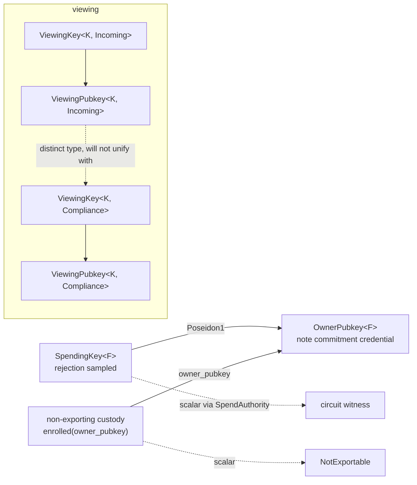

# keystem

Shielded key material for selective disclosure: spend authority and view authority as distinct key types, with hygiene enforced by the type system instead of by convention.

<!-- ANCHOR: intro -->

`keystem` packages a key schedule that various proof-of-concept crates reimplement: a spending key that authorizes spends, an owner pubkey derived from it that appears inside note commitments, and viewing keypairs that grant read access without spend authority. The derivation rule is the same everywhere it appears:

```text
owner_pubkey = Poseidon1(spending_key)
```

That uniformity is what makes this packaging rather than design. The construction is the Sapling pattern, spend authority separated from view authority, the public spend credential a one way image of the secret.

### how it works

`keystem` ships one generator, rejection sampling, and one hygiene policy: every secret zeroizes on drop, `Debug` on a secret prints `REDACTED`, and serde on a secret is an explicit `expose-secret-serde` opt-in rather than a default.

- **spend**: a `SpendingKey` is canonical by construction, decoded or drawn only through checked paths, and never through a raw byte cast. `derive_owner_pubkey` runs the shared Poseidon1 permutation and returns the public credential.
- **custody**: `SpendAuthority` distinguishes between the key and whatever holds it. The in-memory `SpendingKey` answers both `owner_pubkey` and `scalar`; a non-exporting custodian answers the pubkey and returns `NotExportable` from `scalar`.
- **view**: a `ViewingKey<K, F>` wraps a KEM keypair from a curve family `K`, tagged with a disclosure channel `F`. `Incoming`, `Compliance`, and `Audit` are distinct ZSTs, so a value built for one channel cannot be handed to code expecting another.
- **address**: an `Address` carries the owner pubkey and a viewing pubkey as one value, so a consumer authenticates one credential.

<!-- ANCHOR_END: intro -->



The viewing side is generic over sealring's `Kem` trait rather than over a curve directly. Consumers who need only spend authority take `keystem` with the `viewing` feature off and no sealring in their dependency tree.

Poseidon's permutation state is not zeroized, so a spending key stays recoverable from process memory until the next derivation on that thread.

<!-- ANCHOR: design -->

## rationale

Three crates carry the spending-key and owner-pubkey pair with the same derivation rule and near-identical code. Two more carry the encryption-key side on x25519 instead of k256, and one of those derives its spending key in a way that destroys most of its entropy. Fixing each crate in place would fix the bug in one place and leave the same construction free to drift again in the next PoC; packaging the schedule once removes the chance to reintroduce a truncated spending key or a serde derive on a secret.

Rejection sampling is the one randomness policy: a candidate fills the modulus byte width, masks its top byte down to `MODULUS_BIT_SIZE`, and re-draws on rejection. That mask is what keeps acceptance at or above one half for every field inside the width bound, rather than collapsing toward zero for a field whose modulus sits far below the 256-bit ceiling. BN254 accepts about 76% of draws.

Canonical by construction runs through every type that holds a field element: a `SpendingKey`, an `OwnerPubkey`, or a `SecretScalar` that exists encodes a valid field element, full stop. The check applies to an imported counterparty key exactly as it applies to a locally derived one, which is what keeps `Eq` and `Hash` on `OwnerPubkey` honest, two byte strings that decode to the same field element can only ever be the same value. The check itself decides on the encoding as it arrives: reject a byte set above the field's limb width, then reject an integer at or above the modulus. Neither rejection builds a field element, because every caller keeps the bytes.

## Design decisions

- **one generator, one hygiene policy.** The 216-bit byte-zeroing generator and the 64-bit truncating generator both retire behind rejection sampling. Every secret zeroizes on drop and redacts `Debug`; serde on a secret is the `expose-secret-serde` opt-in, so persisting a spending key is a visible line in a consumer's manifest.
- **`SpendAuthority` is the custody boundary: operations out, key material stays put.** Sync by design, matching PKCS#11 and card stacks. `SpendingKey` is the in-memory impl with `Error = Infallible`; a non-exporting custodian returns `NotExportable` from `scalar()`.
- **the `viewing` feature depends on sealring** sealring already owns the `Kem` abstraction and its curve adapters; it borrows the secret key it is handed and assigns storage hygiene to the consumer holding it.
- **`ViewingKey<K, F>` carries a zero-sized family marker** so distinct disclosure channels are distinct types the compiler keeps apart. Mixing a compliance-viewing branch with an ordinary incoming-viewing branch is the correlation risk this rule exists to prevent. The marker is `PhantomData<fn() -> F>`, so auto traits and variance ignore it and the marker type itself needs no bounds; a consumer adds a channel by defining its own empty type. A `compile_fail` doctest in `src/adapters/x25519.rs` proves two channels do not unify.
- **shipped families are k256 and x25519**

## Features

| feature | pulls in | notes |
|---|---|---|
| `default` | `std` and `poseidon` | spend authority over BN254, ready to use out of the box |
| `spend` | ark-ff | the generic core: key types, the custody trait, randomness, canonical import; no_std capable |
| `bn254` | ark-bn254 | `curves::bn254` aliases the generic types over `Fr`, so consumer code keeps its current spelling |
| `poseidon` | light-poseidon | `derive_owner_pubkey` and the `SpendAuthority` impl for the BN254 key; implies `std` while light-poseidon does |
| `viewing` | sealring | viewing types, family markers, KEM key traits |
| `k256`, `x25519` | sealring's matching adapter plus the curve crate | the shipped adapter impls |
| `serde` | serde | serde on `OwnerPubkey` and `ViewingPubkey` |
| `expose-secret-serde` | | serde on `SpendingKey`; implies `serde` |
| `test-helpers` | | `SealedCustody` and the adapter conformance suite |
| `std` | | forwards std to dependencies |

`default` carries `poseidon`, unlike sealring's `default = []`: BN254 plus Poseidon1 is the schedule every code-proven consumer already runs, so shipping it by default matches how the crate is actually used. Two builds are the intended minimal shapes: `default` for spend authority alone, and `default-features = false, features = ["viewing", "k256"]` for the encryption side alone.

<!-- ANCHOR_END: design -->

<!-- ANCHOR: usage -->

## Usage

```rust,ignore
use keystem::{
    SpendAuthority,
    ViewingKey,
    curves::bn254::SpendingKey,
    family::Incoming,
    test_util::SealedCustody,
};
use rand_chacha::ChaCha20Rng;
use rand_core::SeedableRng;
use sealring::X25519;

let mut rng = ChaCha20Rng::seed_from_u64(42);

// spend authority: rejection sampled, canonical by construction.
let spending_key = SpendingKey::random(&mut rng);
let owner_pubkey = spending_key.derive_owner_pubkey();

// a non-exporting custodian answers the same pubkey and refuses the scalar.
let custody = SealedCustody::enrolled(owner_pubkey);
assert!(custody.scalar().is_err());

// view authority: one channel, kept distinct from any other by its type.
let incoming: ViewingKey<X25519, Incoming> = ViewingKey::random(&mut rng);
let viewing_pubkey = incoming.derive_pubkey();
```

The snippet above is illustrative; `examples/wallet_keys.rs` is the compiled version. It runs this end to end and adds the parts that need more than a few lines: it prints `SpendingKey`'s redacted `Debug`, builds both an `Incoming` and a `Compliance` viewing channel from the same curve to show the two are different types, seals a note to the incoming channel with `sealring::seal` and opens it with `sealring::open`, and round-trips `OwnerPubkey` and `ViewingPubkey` through `serde_json`, the two credentials a wallet actually publishes.

```sh
cargo run -p keystem --example wallet_keys --features poseidon,serde,x25519,test-helpers
```

<!-- ANCHOR_END: usage -->

## Development

### Prerequisites

- [cargo-hack](https://github.com/taiki-e/cargo-hack?tab=readme-ov-file#installation): to test all combinations of feature flags
- [cargo-nextest](https://nexte.st/): rust test runner

### Check

```sh
cargo hack check -p keystem $(python3 ../../.github/scripts/hack-flags.py .)
```

`hack.toml` carries `at-least-one-of = ["spend", "viewing"]`, because a build enabling neither compiles to an empty crate and `lib.rs` rejects it with a `compile_error!` naming the two features. The bare `--feature-powerset` would generate that combination and fail on it.

### Clippy

```sh
cargo hack clippy -p keystem $(python3 ../../.github/scripts/hack-flags.py .) -- -D warnings
```

### Format

```sh
cargo +nightly fmt -p keystem
```

### Testing

```sh
cargo hack nextest run -p keystem $(python3 ../../.github/scripts/hack-flags.py .)
cargo test --doc -p keystem --all-features
```

### Benchmarks

Measured on aarch64 Linux, Rust 1.95.0, release profile with fat LTO. Absolute numbers will move with your machine; the ratios are the point.

| operation | k256 | x25519 |
|---|---|---|
| `ViewingKey::random` | 11.9 us | 7.72 us |
| `from_sk_bytes` | 12.0 us | 7.58 us |
| `derive_pubkey` | 3.25 ns | 1.52 ns |
| `to_sk_bytes` | 5.59 ns | 5.70 ns |
| `ViewingPubkey::to_bytes` | 33.7 ns | 1.49 ns |
| `ViewingPubkey::from_bytes` | 3.37 us | 2.40 ns |

| spend operation | time |
|---|---|
| `derive_owner_pubkey` | 16.6 us |
| `SpendingKey::random` | 90.0 ns |
| `from_canonical_bytes`, accepted | 11.7 ns |
| `from_canonical_bytes`, rejected | 3.07 ns |
| `OwnerPubkey::to_field` | 14.1 ns |
| `OwnerPubkey::from_field` | 7.83 ns |
| `SpendingKey::scalar` | 9.10 ns |

`benches/spend.rs` (feature `poseidon`) covers key generation and Poseidon1 derivation, and `benches/viewing.rs` (features `k256`, `std`, `x25519`) covers viewing keypair generation and pubkey derivation across both shipped curve families.

```sh
cargo bench -p keystem -- --list
```

See the [Cargo.toml entry](Cargo.toml) for the exact feature flags each bench target requires.
