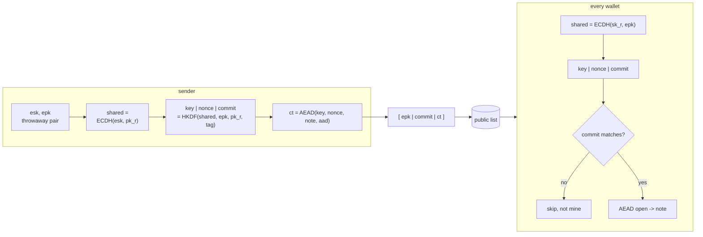

# sealring

A generic sealed-note envelope: seal a note to a recipient public key, open it with the recipient secret key, and batch trial-decrypt a mixed inbox for wallet scanning.

<!-- ANCHOR: intro -->

`sealring` (a sealing ring is a mechanical seal) packages note-encryption architecture that shielded-pool and stealth-address PoCs keep reimplementing: secp256k1 or X25519 ECDH, HKDF-SHA256, ChaCha20-Poly1305. 

### how it works

A shielded pool publishes every note to one list. A note names no recipient, so a wallet cannot spot its own by looking; it has to try its key against all of them.

- **seal**: the sender mixes a throwaway key pair with the recipient public key, encrypts the note under the result, and publishes the throwaway public key beside it.
- **open**: the recipient redoes the mix with their secret key, gets the same key back, decrypts.
- **scan**: `Scanner` does that over a whole inbox. A short `commit` tag rejects a foreign envelope on a constant-time compare instead of a full decryption, and a chunk of 64 shares one field inversion instead of paying one each.

An observer sees the throwaway key, the tag, and the ciphertext, and learns no recipient, no sender, and no link between them.

<!-- ANCHOR_END: intro -->



The crate owns one fixed, hardened protocol flow (suite v1: HKDF-SHA256 plus ChaCha20-Poly1305). Consumers supply genericity through two small traits, `Kem` for curve choice and `Domain` for the note codec and tag. This approach makes tradeoffs specific to its callers and is not intended for production use.

<!-- ANCHOR: design -->

## rationale

every PoC that needs this envelope rebuilds it: ECDH to a fresh key, a KDF, an AEAD. What a rewrite drops is the part that matters. `pk_r` left out of the KDF info, no key commitment, a nonce picked by hand, secrets left in freed buffers. `sealring` fixes that flow once and lets a consumer vary only the curve and the note codec.

The scan loop is the other half. The obvious version is `for e in inbox { open(&me, e, aad) }`: one decapsulation per envelope, and on k256 one field inversion per envelope to bring the shared point back to affine. `Scanner::scan` runs fixed 64-envelope chunks through `Kem::decap_batch`, where k256 spends one `batch_normalize` per chunk, and reuses one scratch buffer for the whole scan; `scan_parallel` puts whole chunks on rayon. Measured at 1024 envelopes, 1% hit rate, 48-byte notes, 14 cores:

| adapter | naive `open` loop | `scan` | `scan_parallel` |
|---|---|---|---|
| x25519 | 20.0 ms | 20.2 ms | 2.22 ms |
| k256 | 22.6 ms | 21.2 ms | 2.40 ms |

Batching alone is worth about 6% on k256 and nothing on x25519, which has no inversion to amortize; the parallel path is the ~9x. Reproduce with `cargo bench -p sealring --bench scan`.

## Design decisions

- suite v1 is fixed: consumers cannot swap the KDF or AEAD. pluggability stops at `Kem` and `Domain`.
- not RFC 9180, though suite v1 is shaped like HPKE base mode single-shot. The HPKE KEM registry stops at P-256, P-384, P-521, X25519, and X448, so neither the k256 nor the grumpkin adapter could conform. HPKE is also not key-committing, and `commit` is what lets a scanner reject a foreign envelope before the AEAD runs; deriving one through the export interface is off spec anyway. Consumers who need only X25519 and no scanning are better served by an HPKE implementation.
- the recipient public key (`pk_r`) is mixed into the KDF info. Without it, a low-order or attacker-crafted ephemeral key would make every recipient derive the same key and accept the same envelope; binding `pk_r` keeps the derived key recipient-specific even under adversarial input.
- the AEAD nonce is derived from the KDF. It binds the nonce to the same transcript as the key, so a key-schedule edit that changes one changes both, and an implementer never picks a nonce by hand. It buys nothing against an RNG replay: a replayed ephemeral key reproduces the shared secret, hence the key and the nonce alike. Callers who need to survive a VM snapshot or fork must rotate the recipient key or bind a counter into the AAD.
- every envelope carries a key-commitment tag (`commit`), a third HKDF-Expand output over the same transcript as the key and nonce. It commits to that transcript, not to the ciphertext the way CTX does, which is enough here because the AEAD tag already binds the ciphertext. ChaCha20-Poly1305 is not key-committing on its own, so one crafted ciphertext could otherwise open validly under two different recipients' keys to two different plaintexts, and a trial-decryption scanner would accept it automatically. `open` recomputes `commit` and compares it in constant time before the AEAD ever runs.
- anonymous sender by design: there is no sender authentication anywhere in the envelope, and none is planned.
- adapter correctness is enforced by a conformance test suite (`test-helpers` feature), not by trait bounds: garbage byte strings, low-order points, the identity point, and all-zero Diffie-Hellman outputs must all fail to decapsulate, `derive_pk` must reproduce the public key belonging to a secret key, and `decode_pk` must invert `encode_pk` while rejecting the same garbage `decap` rejects. Third-party `Kem` implementations are expected to run it.
- secret hygiene is not decorative: `SecretKey` and `SharedSecret` carry no `Debug`, `Clone`, or derived `PartialEq`; commit comparison and other secret-adjacent equality checks go through `subtle`; every `SharedSecret` is zeroized once consumed, including scanner scratch buffers, derived key material, and batch out-slots. One residue is upstream: `hkdf` 0.13 keeps the extracted PRK inside an HMAC state that has no `Zeroize` impl, so that copy lives until the allocation is reused.

<!-- ANCHOR_END: design -->

<!-- ANCHOR: usage -->

## Usage

```rust,ignore
use std::convert::Infallible;

use sealring::{Domain, Recipient, open, seal};
use rand_chacha::ChaCha20Rng;
use rand_core::SeedableRng;
use x25519_dalek::StaticSecret;

struct WalletDomain;

impl Domain for WalletDomain {
    type Note = Vec<u8>;
    // this codec accepts every note; a domain with a real format names its
    // own rejection type here.
    type Error = Infallible;
    const DOMAIN_TAG: &'static str = "sealring-example/v1";

    fn encode_note(note: &Self::Note, out: &mut Vec<u8>) -> Result<(), Self::Error> {
        out.extend_from_slice(note);
        Ok(())
    }

    fn decode_note(bytes: &[u8]) -> Result<Self::Note, Self::Error> {
        Ok(bytes.to_vec())
    }
}

let mut rng = ChaCha20Rng::seed_from_u64(42);

let me = Recipient::<sealring::X25519>::new(StaticSecret::random_from_rng(&mut rng));

let note = b"pay alice 5 units".to_vec();
let aad = b"block-height:1000";

let envelope =
    seal::<sealring::X25519, WalletDomain>(me.public_key(), &note, aad, &mut rng).unwrap();
let opened = open::<sealring::X25519, WalletDomain, _>(&me, &envelope, aad).unwrap();
assert_eq!(opened, Some(note));
```

The snippet above is illustrative; `examples/seal_open.rs` is the compiled version. It runs this end to end and adds `Scanner`, the batch path: instead of calling `open` once per envelope, a wallet builds one `Scanner` from its `Recipient` and scans a whole inbox in fixed-size chunks. A commit mismatch means the envelope was not addressed to this key and is skipped; a commit match with a failure afterward (AEAD, note decoding, `Domain::verify`) means an authenticated envelope that is wrong, and is surfaced as `Err(Malformed)` rather than dropped, because silently dropping an authenticated note can lock funds invisibly.

```sh
cargo run -p sealring --example seal_open --features x25519
```

### Features

| feature | pulls in | notes |
|---|---|---|
| (default) | nothing | traits and suite v1 only; bring your own `Kem` |
| `k256` | k256 with `ecdh` | secp256k1, matches most iptf-pocs consumers |
| `x25519` | x25519-dalek | |
| `grumpkin` | ark-grumpkin | heaviest adapter; duplicates the rand/digest stack because arkworks still sits on rand_core 0.6 and digest 0.10. The adapter never routes the caller's rng into arkworks: it draws raw bytes from `CryptoRng` and builds the scalar with `from_le_bytes_mod_order` |
| `parallel` | rayon | chunked scan across the rayon thread pool, `Scanner::scan_parallel` |
| `serde`, `wincode` | gated derives on `SealedNote` | rotortree pattern, serializes the byte string only |
| `std` | forwards std to dependencies | |
| `test-helpers` | `MockKem`, `TestDomain`, the adapter conformance suite | |

`default = []` on purpose: any default adapter would drag its curve into every workspace member through feature unification, and consumers are split between k256 and x25519 already.

<!-- ANCHOR_END: usage -->

## Development

### Tuning

`SCAN_CHUNK` and `MAX_CT_LEN` are constants, and only tunable by the maintainers here: both size fixed-length arrays and the scanner's pre-reserved buffers, so a consumer reads them and cannot set them. 

- `SCAN_CHUNK` (`64`): envelopes decapsulated per `Kem::decap_batch` call inside `Scanner::scan`. The k256 adapter overrides `decap_batch` to spend one field inversion per chunk instead of one per envelope (`batch_normalize`), so a larger chunk would amortize that cost further at the price of a larger working set.
- `MAX_CT_LEN` (`64 KiB`): the ciphertext length bound `SealedNote::parse` enforces, and the size the scanner's scratch buffer is pre-reserved to so a scan never grows it. Notes above 64 KiB minus the 16-byte AEAD tag do not fit.
- `parallel`: routes each chunk's derive-and-decrypt step across rayon instead of the scanner's own reused buffers, since those cannot be shared across threads. It pays off once a chunk's decrypt work dominates the `decap_batch` call that precedes it, which in practice means scanning enough envelopes per call that thread handoff is not the bottleneck. Benchmark your workload with `benches/scan.rs` before enabling it in a hot path.

### Prerequisites

- [cargo-hack](https://github.com/taiki-e/cargo-hack?tab=readme-ov-file#installation): to test all combinations of feature flags
- [cargo-nextest](https://nexte.st/): rust test runner

### Check

```sh
cargo hack check -p sealring --feature-powerset
```

### Clippy

```sh
cargo hack clippy -p sealring --feature-powerset -- -D warnings
```

### Format

```sh
cargo +nightly fmt -p sealring
```

### Testing

```sh
cargo hack nextest run -p sealring --feature-powerset
```

Golden vectors under `tests/golden/` freeze the wire format per adapter; a mismatch there is a format break, not a flaky test.

### Benchmarks

```sh
cargo bench -p sealring -- --list
```

`benches/scan.rs` is feature-gated; see the [Cargo.toml entry](Cargo.toml) for the exact flags.
